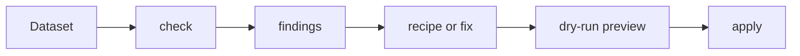

# Todo: Project Cleanup

Goal: make Woodpecker easier to enter, scan, and maintain by reducing repeated
explanation. Start with documentation because reviewers will see that first,
then clean up code comments, names, and helper structure where it is too
talkative.

## Why This Matters

- Reviewers are happy with the feature set, but the project currently asks them
  to read too much before they can understand the basics.
- `README.md` should be the main entry point and the only document needed to get
  started.
- Detailed docs should stay available, but they should be clearly secondary:
  linked when needed, not required up front.
- Code should explain intent through names and structure first. Comments and
  docstrings should clarify non-obvious behavior, not restate each line.

## Cleanup Principles

- Prefer one clear path over many parallel introductions.
- Keep the README short, practical, and precise.
- Move detail to topic pages instead of repeating it.
- Make headings action-oriented and easy to scan.
- Prefer bullets, small tables, and one simple Mermaid diagram where they reduce
  reading time.
- Keep examples minimal and runnable.
- Remove prose that explains the obvious.
- Keep technical precision where behavior, safety, or API contracts depend on it.

## Phase 1: README First

- [ ] Rewrite `README.md` as the single getting-started entry point.
- [ ] Target about 60 to 80 lines instead of the current 130+ lines.
- [ ] Keep the opening promise short:
  `Woodpecker checks and applies known climate-data fixes through a small Python API, CLI, and recipes.`
- [ ] Keep badges if useful, but avoid letting them dominate the first screen.
- [ ] Replace the long documentation link list with 3 to 5 links:
  - Full docs
  - Concepts
  - Recipes
  - CLI
  - Contributing
- [ ] Keep one install/setup block.
- [ ] Keep one recipe-based Python example.
- [ ] Keep one CLI example.
- [ ] Keep a very short project map.
- [ ] Move local docs build details and extended contributor setup to
  `docs/docs-development.md` or `docs/CONTRIBUTING_GUIDE.md`.
- [ ] Remove duplicated wording that also appears in `docs/OVERVIEW.md`.

## Phase 2: Docs Structure

- [ ] Decide whether `docs/OVERVIEW.md` is still needed after the README rewrite.
  If it remains, make it a short conceptual overview, not another README.
- [ ] Simplify `docs/index.md` into a compact docs map.
- [ ] Reduce the MkDocs "Getting Started" section to the smallest useful path:
  - Overview or Start Here
  - Concepts
  - Recipes
  - CLI
  - Plugins
- [ ] Move `docs/user-friendliness.md` out of the main getting-started path.
  It is useful backlog material, but not something a new user needs first.
- [ ] Keep generated references under Reference only.
- [ ] Make notebooks/examples easy to find without making them part of the first
  reading path.
- [ ] Check for repeated descriptions of fixes, recipes, plugins, stores, and
  catalogs across `README.md`, `docs/index.md`, `docs/OVERVIEW.md`,
  `docs/concepts.md`, and `docs/recipes.md`.
- [ ] Replace repeated explanations with short summaries plus links to the one
  canonical page.
- [ ] Add one compact Mermaid diagram to show the basic flow, for example:

## Phase 3: Content Editing Pass

- [ ] For each hand-written docs page, remove paragraphs that repeat the page
  title or obvious navigation context.
- [ ] Prefer bullets over long paragraphs when listing behavior, commands,
  decisions, or links.
- [ ] Prefer short examples over multiple similar examples.
- [ ] Keep safety-related details, dry-run behavior, provenance, strict I/O, and
  generated-reference caveats where they affect user decisions.
- [ ] Use consistent terms:
  - fix
  - recipe
  - plugin
  - catalog
  - store
  - finding
- [ ] Avoid introducing multiple names for the same thing.
- [ ] Make every page answer one primary question.

## Phase 4: Test Cleanup

- [ ] Audit which tests are really needed before deleting or merging anything.
- [ ] Keep the most important functional tests: public API flows that check,
  dry-run, apply, and verify fixes for representative dataset families.
- [ ] Keep focused unit tests for parsing, identifiers, selection, recipes,
  stores, provenance, formatting, and other small logic that can fail in
  isolation.
- [ ] Clearly separate test intent:
  - unit tests: small, fast, isolated behavior in `tests/unit/`
  - functional tests: end-to-end public API behavior in `tests/integration/`
- [ ] Keep the existing `tests/integration/` directory name, but document that
  these are the functional end-to-end public API tests.
- [ ] Check for duplicated coverage between:
  - `tests/unit/test_cli_*.py` and API usage examples
  - `tests/unit/test_recipe*.py` and `tests/integration/test_api_recipes_*.py`
  - family-specific fix tests and recipe tests that assert the same correction
  - generated catalog tests and docs generation checks
- [ ] Keep one plain executable example test as the preferred style reference.
- [ ] Move broad workflow checks out of unit tests if they exercise multiple
  subsystems.
- [ ] Move low-level edge cases out of functional tests if they do not need the
  full public API path.
- [ ] Remove checked-in `__pycache__/` files if they are tracked, and make sure
  cache files stay ignored.
- [ ] Add a short `tests/README.md` explaining the difference between unit and
  functional tests, which suite to run first, and where new tests belong.
- [ ] Keep `tests/integration/README.md` or replace it with the new test README
  after the structure is clear.

## Phase 5: Code Cleanup

- [ ] Scan the main modules for comments and docstrings that restate the code:
  - `woodpecker/api.py`
  - `woodpecker/cli.py`
  - `woodpecker/commands.py`
  - `woodpecker/recipe.py`
  - `woodpecker/runner.py`
  - `woodpecker/selection.py`
  - `woodpecker/recipes/*.py`
  - `woodpecker/fixes/*.py`
- [ ] Keep docstrings for public APIs, CLI-facing behavior, and non-obvious
  contracts.
- [ ] Shorten internal comments that explain simple assignments, branching, or
  direct library calls.
- [ ] Prefer clearer helper names over explanatory comments.
- [ ] Look for verbose helper functions that can be simplified without changing
  behavior.
- [ ] Do not combine this cleanup with feature changes.
- [ ] Run tests after code edits.

## Phase 6: Validation

- [ ] Run `make lint`.
- [ ] Run `make test`.
- [ ] Run `make docs`.
- [ ] Skim the rendered docs navigation and first screen.
- [ ] Confirm a new user can answer these in under two minutes:
  - What is Woodpecker?
  - How do I install or set it up locally?
  - How do I run a recipe?
  - Where do I go for concepts, CLI details, plugins, and contributing?

## Suggested First PR Scope

- Rewrite `README.md`.
- Trim or repurpose `docs/OVERVIEW.md`.
- Simplify `docs/index.md`.
- Update `mkdocs.yml` navigation if needed.
- Add the docs flow diagram if it makes the first page easier to scan.
- Do not touch code in the first PR unless required by generated docs.

## Notes For The Next Codex Session

- Keep the visible design simple: short headings, fewer links, fewer first-screen
  choices.
- Use bullets and diagrams to reduce reading, not to decorate the page.
- Preserve detail, but move it behind deliberate links.
- Treat the README as the project lobby: clear, calm, and quick to leave for the
  right room.
- Avoid broad rewrites of generated reference files unless the generator itself
  changes.
- Treat the test cleanup as a classification and duplication audit first. Delete
  or merge tests only after the important public workflows are named.
