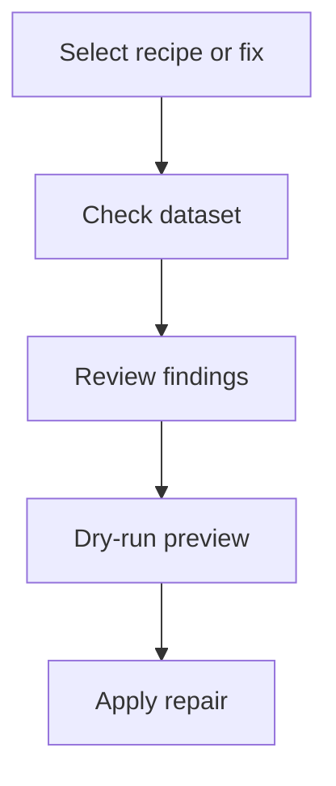

# Overview

Woodpecker is a small repair layer for climate-data workflows. It helps you
find known dataset issues, preview the repair, and apply the fix before the data
moves further through a processing pipeline.

## Core Idea

- A **fix** checks for one known issue and can apply one repair.
- A **recipe** orders one or more fixes into a reusable workflow.
- A **plugin** groups dataset-family fixes and recipes under a stable prefix.
- The **Python API** and **CLI** run the same fix and recipe logic.

## Typical Flow

## Which Path Should I Use?

| If you want to... | Start with... |
| ----------------- | ------------- |
| Run a shared workflow | [Discovered Recipes](recipes.md) |
| Learn the vocabulary | [Concepts](concepts.md) |
| Work from the terminal | [CLI](cli.md) |
| Inspect available fixes | [Generated Fixes Reference](FIXES.md) |
| Understand bundled dataset families | [Plugins](plugins.md) |

## Keep Reading

- Use [Concepts](concepts.md) for the object model and identifiers.
- Use [Discovered Recipes](recipes.md) for recipe lookup and discovery.
- Use [CLI](cli.md) for command flags, dry runs, output formats, and safety
  options.
