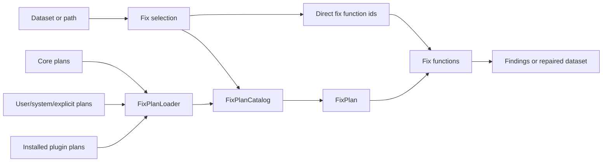

# Concepts

Woodpecker separates executable repair logic from the user-facing workflows
that select and order that logic.

## How The Pieces Fit



Direct fix function ids are useful when you already know exactly what to run.
Fix plans are useful when a workflow should carry ordered steps, options,
matching rules, and links to background material.

## Fix Function

A fix function is an executable Python rule for one known dataset issue. It can
check whether a dataset needs attention and can optionally apply a repair.

Fix functions are registered with stable ids such as:

```text
woodpecker.normalize_tas_units_to_kelvin
cmip6_decadal.time_metadata
atlas.encoding_cleanup
```

Use direct fix function selection when you already know the exact id:

```python
findings = woodpecker.check(
    dataset,
    fixes="woodpecker.normalize_tas_units_to_kelvin",
)
```

In a fix plan, a fix is a fix function plus optional runtime options. The
[Generated Fixes Reference](FIXES.md) lists registered fix functions.

Fix functions may declare a non-negative `priority` for default discovery
ordering. The default priority is `-1`, which means unprioritized. Explicit fix
plans keep their own step order.

## Fix Plan

A fix plan is a user-facing recipe. It contains an ordered list of fixes and may
also include matching rules, aliases, and links to background material.

Use plans when you want Woodpecker to run a known workflow by id:

```python
plan = woodpecker.plan.get("cmip6.core_units")
findings = woodpecker.plan.check(dataset, plan)
```

The [Generated Fix Plans Reference](FIX_PLANS.md) lists discovered plans.

## Matching

Plans can describe when they apply to a dataset. Matching rules may inspect:

- dataset attributes,
- dataset identity metadata,
- input paths.

Matching helps shared plans stay reusable across automated workflows. Explicit
ids still work when a user wants to choose a plan directly.

## Fix Plan Store

A fix plan store is a lookup layer for plan definitions. Stores can list plans,
load a plan by id, and find plans that match a dataset.

Woodpecker supports stores for:

- discovered catalog sources,
- JSON or YAML documents,
- DuckDB-backed catalogs,
- auto-generated one-step plans from registered fix functions.

## Fix Plan Loader

`FixPlanLoader` discovers plan documents from common locations:

- explicit files or directories,
- `WOODPECKER_FIX_PLAN_PATH`,
- user configuration directories,
- system configuration directories,
- core package resources,
- installed plugin package `plans/` resources.

See [Discovered Fix Plans](plans.md) for the discovery order and examples.

## Fix Plan Catalog

`FixPlanCatalog` aggregates one or more plan sources behind a single lookup
surface. It can list plans, resolve ids and aliases, find matching plans, and
deduplicate results by plan id.

Catalog-backed lookup is the default path for shared core and plugin workflows.

## Plugins

Plugins keep dataset-family behavior outside the core package. A plugin can
register fix functions and may bundle plan documents in a package `plans/`
directory.

Each plugin owns a namespace prefix, for example:

| Package | Prefix |
| ------- | ------ |
| `woodpecker-atlas-plugin` | `atlas` |
| `woodpecker-cmip6-plugin` | `cmip6` |
| `woodpecker-cmip6-decadal-plugin` | `cmip6_decadal` |
| `woodpecker-cmip7-plugin` | `cmip7` |
| `woodpecker-xmip-plugin` | `xmip` |

See [Plugins](plugins.md) for bundled plugin status and plan coverage.

## Identifiers

Fixes and plans use stable ids in the form:

```text
prefix.suffix
```

The prefix names the owning package or plugin. The suffix names the fix or plan
within that namespace. Use full ids in examples, plans, and automation so
references stay explicit.

Aliases can provide extra names for the same suffix, but canonical ids are the
preferred form in documentation.
