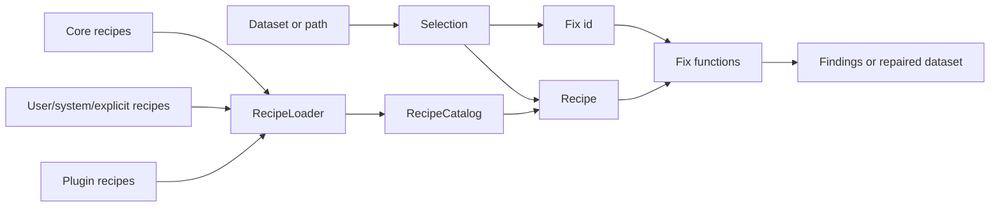

# Concepts

Woodpecker separates repair logic from the workflows that select, order, and
run that logic.

## Short Version

- **Fix**: one check or repair.
- **Recipe**: ordered fixes for one workflow.
- **Plugin**: dataset-family fixes and recipes.

## Map



## Terms

| Term | Meaning | Use when... |
| ---- | ------- | ----------- |
| Fix function | Python rule for one known dataset issue. | You know the exact repair id. |
| Recipe | Ordered workflow of one or more fixes. | You want a named, reusable repair path. |
| Matching | Rules that decide whether a recipe applies. | Recipes should be selected from dataset metadata or paths. |
| Recipe store | Source of recipe definitions. | Recipes live in files, catalogs, package resources, or generated sources. |
| RecipeLoader | Discovers recipe documents. | Recipes may come from several locations. |
| RecipeCatalog | Lookup surface across recipe sources. | You need list, get, match, alias, and deduplication behavior. |
| Plugin | Dataset-family package with fixes and recipes. | Behavior should live outside the core package. |
| Identifier | Stable `prefix.suffix` name. | Docs, recipes, tests, and automation need explicit references. |

## Fixes

Fix functions can check a dataset and optionally apply a repair.

Examples:

```text
woodpecker.normalize_tas_units_to_kelvin
cmip6_decadal.time_metadata
atlas.encoding_cleanup
```

Direct selection:

```python
findings = woodpecker.check(
    dataset,
    fixes="woodpecker.normalize_tas_units_to_kelvin",
)
```

Notes:

- Use direct fix ids when you already know exactly what to run.
- Use [Fix Reference](FIXES.md) to inspect registered fixes.
- Fix priority only affects default discovery order. Recipe steps keep their
  explicit order.

## Recipes

Recipes turn one or more fixes into a named workflow.

```python
recipe = woodpecker.recipe.get("cmip6.core_units")
findings = woodpecker.recipe.check(dataset, recipe)
```

Recipes may include:

- ordered fix steps,
- fix options,
- matching rules,
- aliases,
- links to background material.

Use [Recipes](recipes.md) for discovery behavior and
[Recipe Reference](recipe-reference.md) for the current catalog.

## Matching

Recipe matching may inspect:

- dataset attributes,
- dataset identity metadata,
- input paths.

Matching is for automatic or assisted selection. Explicit recipe ids still work
when a user chooses a workflow directly.

## Recipe Sources

`RecipeLoader` discovers recipe documents from:

- explicit files or directories,
- `WOODPECKER_RECIPE_PATH`,
- user configuration directories,
- system configuration directories,
- core package resources,
- installed plugin `recipes/` resources.

`RecipeCatalog` combines those sources behind one lookup API.

## Plugins And Prefixes

Plugins own namespace prefixes:

| Package | Prefix |
| ------- | ------ |
| `woodpecker-atlas-plugin` | `atlas` |
| `woodpecker-cmip6-plugin` | `cmip6` |
| `woodpecker-cmip6-decadal-plugin` | `cmip6_decadal` |
| `woodpecker-cmip7-plugin` | `cmip7` |
| `woodpecker-xmip-plugin` | `xmip` |

Use [Plugins](plugins.md) for bundled plugin status and recipe coverage.

## Identifiers

Fixes and recipes use:

```text
prefix.suffix
```

- `prefix`: owning package or plugin.
- `suffix`: fix or recipe name inside that namespace.
- canonical ids are preferred in docs, recipes, tests, and automation.
- aliases may exist, but they should not replace canonical ids in examples.
