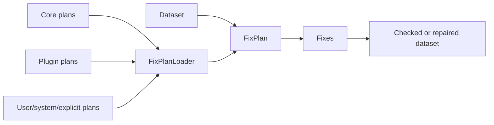

# Discovered Fix Plans

Fix plans are ordered workflows. They select one or more fixes, provide options
for those fixes, and can include matching rules for dataset metadata or source
paths.

Most users should load plans by id:

```python
import woodpecker

plan = woodpecker.plan.get("xmip.cmip6_preprocessing")
findings = woodpecker.plan.check(dataset, plan)
preview = woodpecker.plan.fix(dataset, plan, dry_run=True)
```

The same id works from the CLI:

```bash
woodpecker check ./data --plan-id xmip.cmip6_preprocessing
woodpecker fix ./data --plan-id xmip.cmip6_preprocessing --dry-run
```

## Where Plans Come From

`FixPlanLoader` coordinates plan discovery in this order:

- explicit files or directories passed to catalog-backed APIs,
- `WOODPECKER_FIX_PLAN_PATH`,
- user configuration directories such as `~/.config/woodpecker/fix-plans`,
- system directories such as `/etc/woodpecker/fix-plans`,
- core Woodpecker package resources,
- installed plugin package `plans/` resources.

Use `woodpecker list-plans` to inspect the discovered set.

## How It Fits



## Direct Files

Explicit files are still useful for local experiments, tests, and private
workflows:

```python
findings = woodpecker.plan.check(dataset, "my-plans.yaml")
```

Use discovered plans for shared core and plugin workflows. Use explicit files
when you are authoring or testing a new local plan document.

## Python Authoring

Plan documents can be authored in Python and serialized to the same JSON/YAML
schema used by stores and the CLI:

```python
from woodpecker.fix_plans import fix, plan

cmip6_core = (
    plan(
        "cmip6.core_units",
        fix("woodpecker.normalize_tas_units_to_kelvin"),
        description="Normalize CMIP6 tas units.",
    )
    .match(
        dataset_id_patterns=["CMIP6.CMIP.*.Amon.tas.*"],
        attrs={"project_id": "CMIP6", "activity_id": "CMIP"},
    )
)

cmip6_core.to_yaml("cmip6_core_plan.yaml")
cmip6_core.to_json("cmip6_core_plan.json")
```

Use `to_model()` when you want the in-memory `FixPlan`, or `to_document()` when
you want a `FixPlanDocument`.
