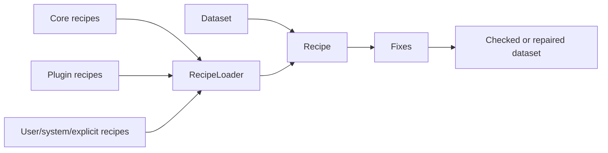

# Recipes

Recipes are ordered repair workflows. They group fixes, options, and optional
matching rules under a stable id.

## Run A Recipe

```python
import woodpecker

recipe = woodpecker.recipe.get("xmip.cmip6_preprocessing")
findings = woodpecker.recipe.check(dataset, recipe)
preview = woodpecker.recipe.fix(dataset, recipe, dry_run=True)
preview.preview
```

```bash
woodpecker check ./data --recipe-id xmip.cmip6_preprocessing
woodpecker fix ./data --recipe-id xmip.cmip6_preprocessing --dry-run
```

Use [Recipe Reference](recipe-reference.md) to inspect discovered recipe ids.

## Discovery Order

`RecipeLoader` discovers recipe documents from:

1. explicit files or directories passed to catalog-backed APIs
2. `WOODPECKER_RECIPE_PATH`
3. user config, such as `~/.config/woodpecker/recipes`
4. system config, such as `/etc/woodpecker/recipes`
5. core package resources
6. installed plugin package `recipes/` resources

Inspect the active set:

```bash
woodpecker list-recipes
```

## How It Fits



## Choosing A Source

| Source | Best for |
| ------ | -------- |
| Discovered recipe id | Shared core and plugin workflows. |
| Explicit recipe file | Local experiments, tests, and private workflows. |
| Python builder | Authoring JSON or YAML recipe documents from code. |

Explicit file example:

```python
findings = woodpecker.recipe.check(dataset, "my-recipes.yaml")
```

## Python Authoring

```python
from woodpecker.recipes import fix, recipe

cmip6_core = (
    recipe(
        "cmip6.core_units",
        fix("woodpecker.normalize_tas_units_to_kelvin"),
        description="Normalize CMIP6 tas units.",
    )
    .match(
        dataset_id_patterns=["CMIP6.CMIP.*.Amon.tas.*"],
        attrs={"project_id": "CMIP6", "activity_id": "CMIP"},
    )
)

cmip6_core.to_yaml("cmip6_core_recipe.yaml")
cmip6_core.to_json("cmip6_core_recipe.json")
```

- `to_model()` returns an in-memory `Recipe`.
- `to_document()` returns a serializable `RecipeDocument`.
