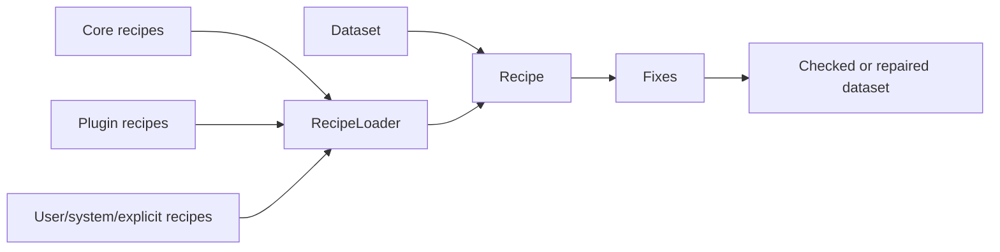

# Discovered Recipes

Recipes are ordered repair workflows. They select one or more fixes, provide
options for those fixes, and can include matching rules for dataset metadata or
source paths.

Most users should load recipes by id:

```python
import woodpecker

recipe = woodpecker.recipe.get("xmip.cmip6_preprocessing")
findings = woodpecker.recipe.check(dataset, recipe)
preview = woodpecker.recipe.fix(dataset, recipe, dry_run=True)
preview.preview
```

The same id works from the CLI:

```bash
woodpecker check ./data --recipe-id xmip.cmip6_preprocessing
woodpecker fix ./data --recipe-id xmip.cmip6_preprocessing --dry-run
```

## Where Recipes Come From

`RecipeLoader` coordinates recipe discovery in this order:

- explicit files or directories passed to catalog-backed APIs,
- `WOODPECKER_RECIPE_PATH`,
- user configuration directories such as `~/.config/woodpecker/recipes`,
- system directories such as `/etc/woodpecker/recipes`,
- core Woodpecker package resources,
- installed plugin package `recipes/` resources.

Use `woodpecker list-recipes` to inspect the discovered set.

## How It Fits



## Direct Files

Explicit files are still useful for local experiments, tests, and private
workflows:

```python
findings = woodpecker.recipe.check(dataset, "my-recipes.yaml")
```

Use discovered recipes for shared core and plugin workflows. Use explicit files
when you are authoring or testing a new local recipe document.

## Python Authoring

Recipe documents can be authored in Python and serialized to the same JSON/YAML
schema used by stores and the CLI:

```python
from woodpecker.recipes import fix, recipe

cmip6_core = (
    recipe(
        "cmip6.core_units",
        fix("woodpecker.normalize_tas_units_to_kelvin"),
        description="Normalize CMIP6 tas units.",
    )
    .match(
        dataset_id_patterns=["CMIP6.CMIP.*.Amon.tas.*"],
        attrs={"project_id": "CMIP6", "activity_id": "CMIP"},
    )
)

cmip6_core.to_yaml("cmip6_core_recipe.yaml")
cmip6_core.to_json("cmip6_core_recipe.json")
```

Use `to_model()` when you want the in-memory `Recipe`, or `to_document()` when
you want a `RecipeDocument`.
